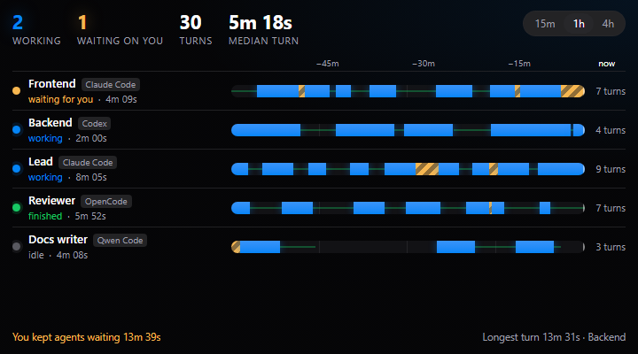
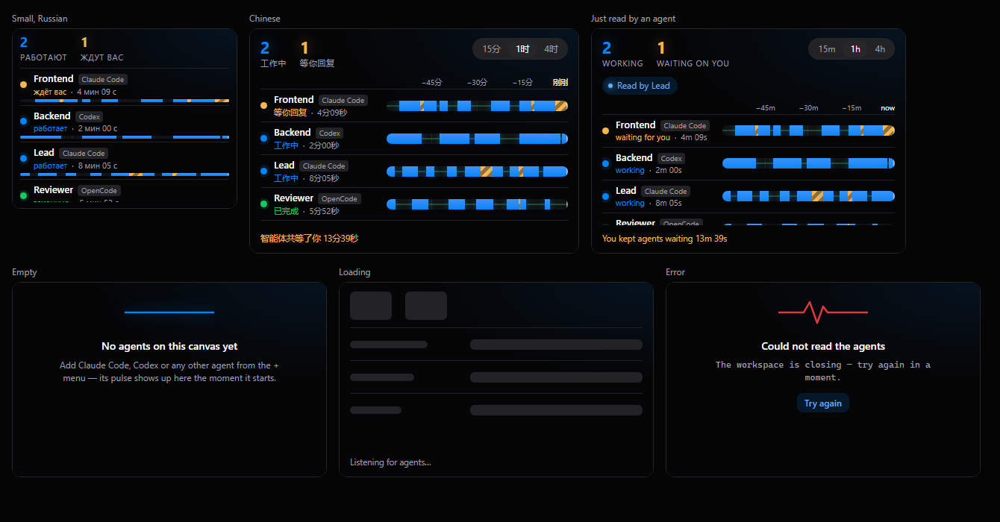

# Agent Pulse

A live pulse of every agent on your [NeuroSquad](https://neurosquad.ai) canvas:
a status timeline per agent, turn counts and durations, and — the number people
remember — **how long agents have been waiting for you**.



- **Timeline lanes** for the last 15 minutes, hour or 4 hours: working (blue),
  waiting for you (amber stripes), finished, idle, stopped.
- **KPIs**: agents working now, agents waiting on you, turns finished, median
  turn length; footer with the total time agents waited on you and the longest
  turn.
- **Nudges**: when an agent waits longer than you set (default 5 min), the card
  pulses softly and shows up in the Inbox. No sounds, no OS notifications.
- **A tool for agents**: a connected lead agent can call
  `agent_pulse_report` to see who is idle (delegate to them) and who is blocked
  on you. The card shows "Read by …" when that happens.
- **Ports**: `report` (Markdown table, from the card menu → *Send report*) and
  `turns` (one `ns:event` per finished turn — pipe it into another card).
- Header chip, badge (agents waiting on you) and the zoomed-out overview tile
  are filled in, so you can read the pulse from across the canvas.
- English, Russian and Chinese, following the app's language live.



## Permissions

| Permission | Required | Why |
| --- | --- | --- |
| `agents.read` | yes | Agent names, harness and status (working / waiting / finished). That is all the timeline needs. The card **never** reads what agents print, and it cannot prompt them. |
| `cards.connected` | optional | Asked only when you send a report into a connected built-in note, checklist or sticky. Sending to another custom card needs nothing. |

No network, no files, no clipboard. History (at most a day) is kept in the
card's own storage.

## Performance

The lanes re-render once a second **only while the card is on screen**; zoomed
out, off-screen or in a hidden workspace the card only records status events
(a few per minute) and the host shows the overview tile. History is saved at
most every 3 s, when hidden and on suspend.

## Develop

```sh
npm install
npm run dev        # the card on the SDK's mock host with a simulated team
npm test           # model + controller tests against createMockHost()
npm run build      # → dist/ (commit it: the app installs the repository as is)
npm run validate   # the app's own checks + the install dialog preview
npm run pack       # what would be installed, and the tree hash
```

Preview states: `?state=filled|empty|loading|error|updated&lang=en|ru|zh&live=0`.
In the app: **Settings → Custom cards → Developer mode**, then
`npx neurosquad-card dev`.

### The SDK dependency

The card depends on [`@neurosquad/card-sdk`](https://www.npmjs.com/package/@neurosquad/card-sdk)
from npm (`^1.0.0`). `dist/` is committed on purpose: NeuroSquad installs the
repository as it is and never runs a build, so rebuild and commit `dist/`
together with every source change.

## Install

This is an official NeuroSquad card from
[`glmn-ai/neurosquad-cards`](https://github.com/glmn-ai/neurosquad-cards), listed in its
[verified catalog](../../verified.json). Install it from the verified catalog in
**Settings → Custom cards**, or paste the source
`glmn-ai/neurosquad-cards/official-cards/agent-pulse` into **Settings → Custom cards →
Install**. Check the permissions, then add the card from the canvas: **+ → Custom card… → Agent Pulse**.

## License

MIT
