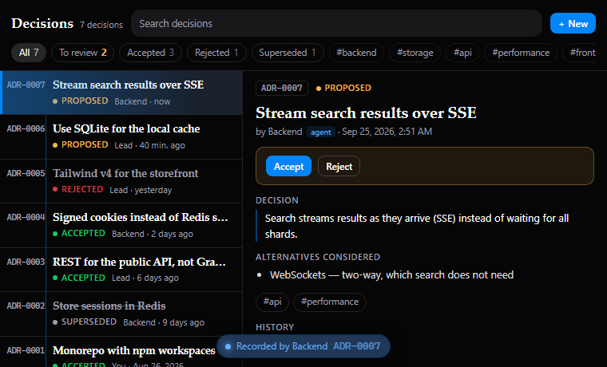
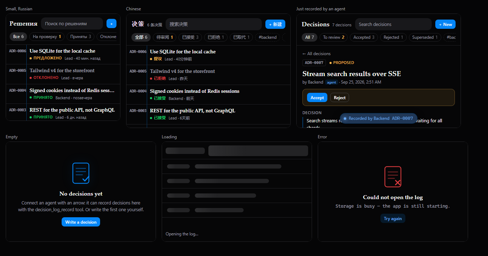

# Decision Log

An ADR-style decision log for your [NeuroSquad](https://neurosquad.ai) canvas.
**Agents write into it over MCP** — every time they pick a library, a data
model or a trade-off — and **you review**: search, accept or reject, link
replacements, and export the lot as ADR files into the repository.



- **Four tools for connected agents** (draw an arrow between the agent and the
  card): `decision_log_record`, `decision_log_search`, `decision_log_get`,
  `decision_log_set_status`. The tool descriptions ask agents to search before
  deciding and to record what they chose and why.
- **Human in the loop**: what an agent records stays *proposed* until you accept
  it (Settings → *Agents may accept decisions themselves* to relax that). The
  badge counts proposals waiting for you; the card pulses softly and shows up
  in the Inbox — a burst of proposals becomes one "3 decisions wait for your
  review".
- **"Just written by an agent"**: the new entry flashes, opens, and a pill says
  who recorded (or read, or changed) it.
- **Browse**: full-text search (every word must match), status filters with
  counts, tag chips, list + detail side by side (stacked on a narrow card),
  supersede links in both directions, history of every change. Add or edit an
  entry by hand.
- **Numbers are never reused**: ADR-0001, ADR-0002, … like a real ledger.
- **Export as ADR files** (card menu): `docs/adr/0007-use-sqlite.md` per entry
  plus `docs/adr/README.md` with an index.
- **Port** `decisions` (`ns:markdown`): each decision is sent when it is
  accepted — to a note, a wiki card, or an agent's prompt.
- Overview tile ("12 decisions · 2 to review" + the latest title), English,
  Russian and Chinese.



## Permissions

It installs with **no permissions at all**: tools, storage and ports need none.

| Permission | Required | Why |
| --- | --- | --- |
| `fs.write` | optional | Asked only when you pick *Export as ADR files*. Writes `docs/adr/*.md` in the workspace folder, nothing else. |
| `cards.connected` | optional | Asked only when you send a decision into a connected built-in note or checklist. Other custom cards need nothing. |

Entries live in the card's own storage (`entry:<n>` keys plus an `index`, so a
long log never hits the 1 MB value limit).

## Performance

No timers, no polling: the card only reacts to tool calls and clicks. Relative
dates are computed when something changes.

## Develop

```sh
npm install
npm run dev        # the card on the SDK's mock host with a sample log
npm test           # model + controller tests against createMockHost()
npm run build      # → dist/ (commit it: the app installs the repository as is)
npm run validate   # the app's own checks + the install dialog preview
npm run pack       # what would be installed, and the tree hash
```

Preview states: `?state=filled|empty|loading|error|updated&lang=en|ru|zh`.
In the app: **Settings → Custom cards → Developer mode**, then
`npx neurosquad-card dev`.

### The SDK dependency

The card depends on [`@neurosquad/card-sdk`](https://www.npmjs.com/package/@neurosquad/card-sdk)
from npm (`^1.0.0`). `dist/` is committed on purpose: NeuroSquad installs the
repository as it is and never runs a build, so rebuild and commit `dist/`
together with every source change.

## Install

This is an official NeuroSquad card from
[`glmn-ai/neurosquad-cards`](https://github.com/glmn-ai/neurosquad-cards), listed in its
[verified catalog](../../verified.json). Install it from the verified catalog in
**Settings → Custom cards**, or paste the source
`glmn-ai/neurosquad-cards/official-cards/decision-log` into **Settings → Custom cards →
Install**. Check the permissions, then add
the card from the canvas: **+ → Custom card… → Decision Log**, and draw an arrow
from your agent to it.

## License

MIT
