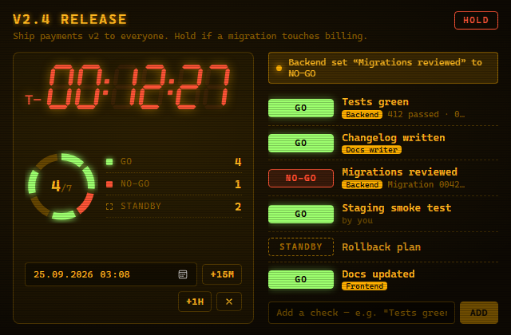
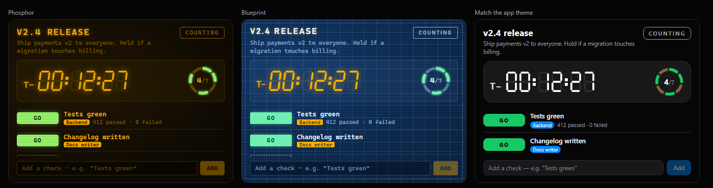
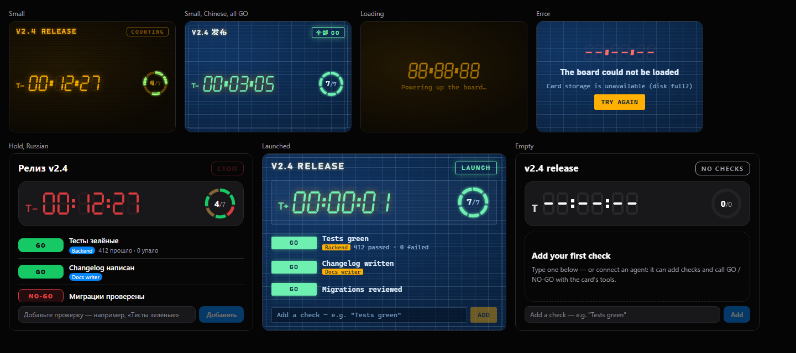

# Launch Control

A mission-control **Go/No-Go board** for releases on your
[NeuroSquad](https://neurosquad.ai) canvas: a big seven-segment countdown to
T−0, a list of launch checks, and agents that call GO or NO-GO on them with a
note. When every check is GO the card sends a **GO signal** down its arrow — to
an agent that starts the release, for example.



- **Countdown** to a time you set (date/time field, +15 min, +1 h). Amber when
  checks are still pending close to T−0, red on HOLD, green when all is GO;
  a short launch animation plays once at T−0, then the clock counts up (T+).
- **Checks**: click the pill to cycle GO → NO-GO → STANDBY, click a name to
  rename, type below to add. Each row shows who set it and why.
- **Agents drive it** through three tools: `launch_control_list_checks`,
  `launch_control_set_check` (with a note) and `launch_control_add_check`. The
  row flashes and a banner says who changed what; a NO-GO from an agent pulses
  the card and lists it in the Inbox.
- **Ports**: input `checks` (`ns:tasks` — draw an arrow from a checklist or task
  board: done → GO, error → NO-GO); outputs `go` (`ns:event`, once when all turn
  GO, retained) and `report` (`ns:markdown`, card menu → *Send status report*).
- **Three looks** (Settings → *Look*): Phosphor (amber CRT with scanlines),
  Blueprint, and *Match the app theme*, which is drawn only from the app's live
  theme tokens. A glow colour setting tints the first two.
- **Card menu**: send the report, compact/full size (the card resizes itself),
  reset every check (asks first).
- Header chip (COUNTING / HOLD / ALL GO / LAUNCH), NO-GO badge and a zoomed-out
  tile like `T−00:12 · 5/7 GO`. English, Russian and Chinese, live.





## Permissions

| Permission | Required | Why |
| --- | --- | --- |
| — | — | Nothing is required: tools, ports, storage, settings and the card chrome need no permission. |
| `cards.connected` | optional | Asked only when you send the status report into a connected built-in note, checklist or sticky. Receiving checks from a checklist and sending GO to another custom card need nothing. |

To start a release from the GO signal, draw an arrow from this card to an
agent — the *agent's* prompt input is what needs consent there.

## Settings

| Setting | Kind | Default |
| --- | --- | --- |
| Mission name | string | `Release` |
| Mission brief | text | — (also given to agents that list the checks) |
| Look | select | Phosphor |
| Glow colour | color | `#ffb000` |
| Show seconds | boolean | on |
| Warn when pending this many minutes before T−0 | number | 10 |

## Performance

The clock ticks once a second **only while the card is on screen**. Off screen
or zoomed out nothing ticks: the tile is recomputed when the card leaves the
screen and once at T−0 (a single timer, not an interval). Animations are
paused whenever the card is not visible.

## Develop

```sh
npm install
npm run dev        # the card on the SDK's mock host with a sample release
npm test           # model + controller tests against createMockHost()
npm run build      # → dist/ (commit it: the app installs the repository as is)
npm run validate   # the app's own checks + the install dialog preview
npm run pack       # what would be installed, and the tree hash
```

Preview states:
`?state=filled|empty|loading|error|updated|hold|go|launched&skin=phosphor|blueprint|app&lang=en|ru|zh`.
In the app: **Settings → Custom cards → Developer mode**, then
`npx neurosquad-card dev`.

Note for card authors: the frame is sandboxed without `allow-forms`, so a
`<form>`'s submit event never fires — the add field uses Enter and a button.

### The SDK dependency

The card depends on [`@neurosquad/card-sdk`](https://www.npmjs.com/package/@neurosquad/card-sdk)
from npm (`^1.0.0`). `dist/` is committed on purpose: NeuroSquad installs the
repository as it is and never runs a build, so rebuild and commit `dist/`
together with every source change.

## Install

This is an official NeuroSquad card from
[`glmn-ai/neurosquad-cards`](https://github.com/glmn-ai/neurosquad-cards), listed in its
[verified catalog](../../verified.json). Install it from the verified catalog in
**Settings → Custom cards**, or paste the source
`glmn-ai/neurosquad-cards/official-cards/launch-control` into **Settings → Custom cards →
Install**. Check the permissions, then
add the card from the canvas: **+ → Custom card… → Launch Control**.

## License

MIT
