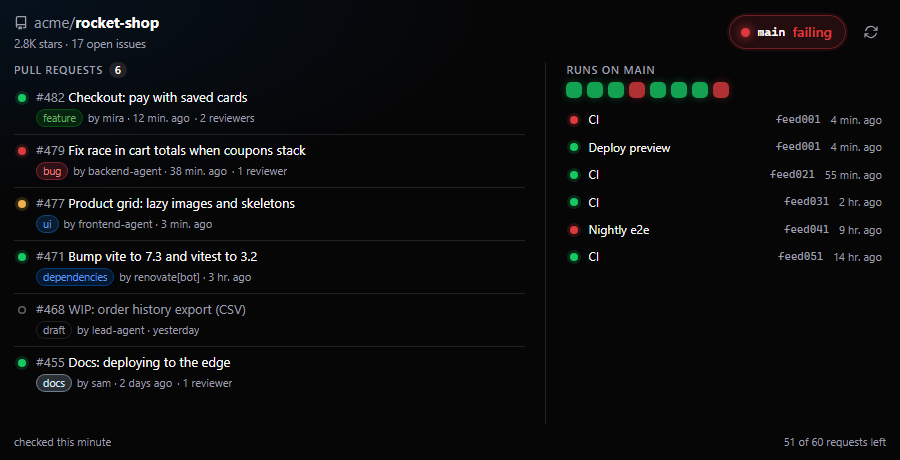
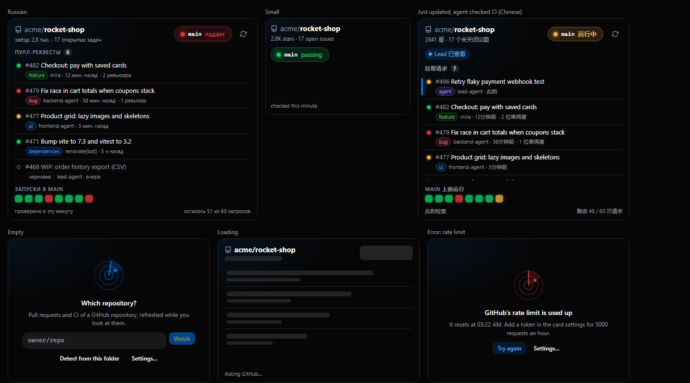

# Repo Radar

Open pull requests and CI of a GitHub repository, right on your
[NeuroSquad](https://neurosquad.ai) canvas — next to the agents that push to it.



- **The default branch's CI as one big pill** (passing / failing / running),
  from its latest push run. Click it to open the run.
- **Open pull requests** with CI per PR, labels, draft state, requested
  reviewers and age. New or changed rows are marked after each refresh.
- **Runs strip** for the default branch; wide cards list them with commits.
- **When the default branch goes red** the card pulses softly (Inbox), its
  header shows a red `CI` badge, and it emits a `ci` event on its port — draw an
  arrow to another card to react to it.
- **A tool for agents**: a connected agent calls `repo_radar_status` after it
  pushes and gets the default branch's CI, every open PR with its branch, head
  commit and CI state, and the latest runs (data is refreshed if older than a
  minute). The card shows "Checked by …" when that happens.
- **Detect from this folder** reads the workspace's `.git/config` to find the
  GitHub remote — only if you press it and allow it.
- English, Russian and Chinese, following the app's language live.



## Permissions

| Permission | Required | Why |
| --- | --- | --- |
| `network` — `api.github.com` only | yes | Reads the repository, its pull requests, check runs and workflow runs. The app's proxy refuses every other host, so the card cannot send anything anywhere else. |
| `fs.read` | optional | Asked only when you press **Detect from this folder**: the card reads `.git/config` and nothing else. |

**The token** (optional setting, for private repositories and 5000 requests an
hour instead of 60) is a *secret* setting: you type it into NeuroSquad's own
settings form, and the card only ever sends the placeholder
`authorization: Bearer {{secret:token}}` — the app fills it in, and only for
requests to `api.github.com`. The card's code never sees the value. A read-only
fine-grained token with *Contents*, *Pull requests*, *Actions* and *Checks* read
access is enough.

## Rate limits and polling

- The card polls **only while it is on screen** (every 5 minutes by default,
  configurable). Zoomed out, off-screen or in a hidden workspace there is no
  timer at all; when it comes back into view with stale data it refreshes at
  once. The agents' tool may refresh while hidden — an agent asked.
- Every request is **conditional** (`If-None-Match` with the last ETag). An
  unchanged repository answers with `304 Not Modified`, which GitHub does not
  count against the rate limit.
- CI of a commit is asked for **once it is final** (passed or failed) and then
  cached; only running ones are re-checked. At most 8 PRs get CI per poll, and
  none when fewer than 10 requests are left.
- The footer shows how many requests are left; a used-up limit shows when it
  resets and the card waits until then.

## Develop

```sh
npm install
npm run dev        # the card on the SDK's mock host with a fake GitHub
npm test           # model + controller tests against createMockHost()
npm run build      # → dist/ (commit it: the app installs the repository as is)
npm run validate   # the app's own checks + the install dialog preview
npm run pack       # what would be installed, and the tree hash
```

Preview states: `?state=filled|empty|loading|error|updated&ci=failure|success|in_progress&lang=en|ru|zh`.
The fake GitHub (`src/fixtures.ts`) answers with GitHub-shaped JSON, ETags,
`304`s and rate-limit headers, and is what the tests use too.

In the app: **Settings → Custom cards → Developer mode**, then
`npx neurosquad-card dev`.

### The SDK dependency

The card depends on [`@neurosquad/card-sdk`](https://www.npmjs.com/package/@neurosquad/card-sdk)
from npm (`^1.0.0`). `dist/` is committed on purpose: NeuroSquad installs the
repository as it is and never runs a build, so rebuild and commit `dist/`
together with every source change.

## Install

This is an official NeuroSquad card from
[`glmn-ai/neurosquad-cards`](https://github.com/glmn-ai/neurosquad-cards), listed in its
[verified catalog](../../verified.json). Install it from the verified catalog in
**Settings → Custom cards**, or paste the source
`glmn-ai/neurosquad-cards/official-cards/repo-radar` into **Settings → Custom cards →
Install**. Check the permissions, then add the card from the canvas: **+ → Custom card… → Repo Radar**,
and type `owner/repo` (or press **Detect from this folder**).

## License

MIT
