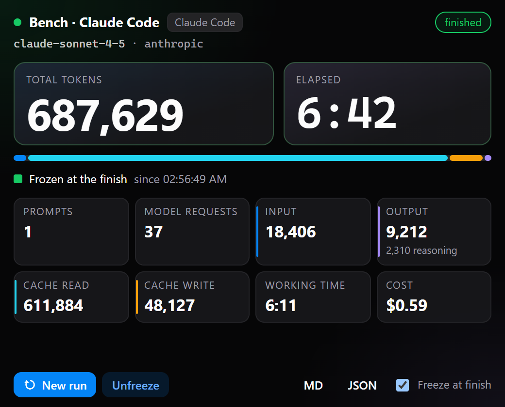
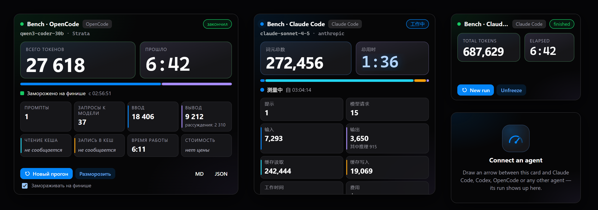
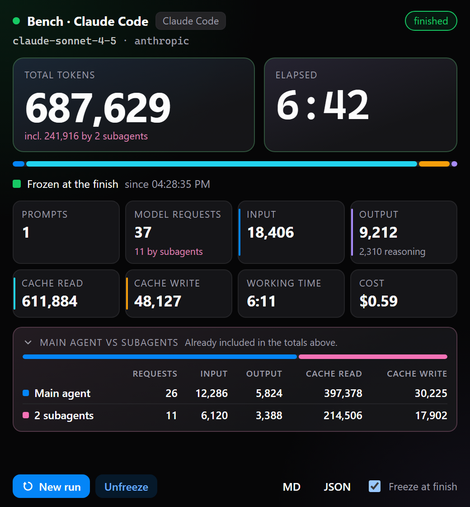

# Run Stats

One agent's run on your [NeuroSquad](https://neurosquad.ai) canvas in big, exact
numbers — **prompts, model requests, input / output / cache tokens, elapsed and
working time** — ready for a screenshot or a report. The official NeuroSquad
card for benchmarks: give several CLI agents (Claude Code, Codex, OpenCode, …)
the same prompt on the same model, put a Run Stats card next to each, compare.



- Draw an **arrow** between the card and an agent — the card measures that
  agent (several connected: pick one).
- **Start measuring now / New run**: the run is the next prompt. A card just
  connected measures the agent's whole history (for a fresh agent: the run).
- **Freeze at finish** (on by default): the numbers are pinned when the agent
  finishes, so they stay put for the screenshot. **Freeze / Unfreeze** by hand.
- **MD / JSON**: copy the results; **Send to note** (card menu): a Markdown
  table into a connected note (port `results`, `ns:markdown`).
- Overview tile (zoomed out): total tokens · elapsed; requests · harness.
- English, Russian and Chinese, following the app's language live.



## Subagents (new in 1.1)



When the agent hands work to **subagents** (Claude Code's Agent tool, OpenCode
/ Kilo `task` sessions, …), their requests are the agent's — what you pay for —
so every number above **includes** them. Run Stats 1.1 also shows which part
they made:

- **"incl. 241,916 by 2 subagents"** under Total tokens and **"11 by
  subagents"** under Model requests.
- **Main agent vs subagents** — requests, input, output, cache read, cache
  write (and total tokens when the card is wide) for the agent's own loop and
  for its subagents, with a two-part bar of their token shares. A card tall
  enough (or expanded) shows it open; a smaller one shows a chip on the status
  line — click it to open the table.
- Markdown / JSON / *Send to note* carry the breakdown too (JSON: `subagents`
  with `count`, `mainOnly`).
- Nothing extra when no subagent ran. On NeuroSquad before 0.1.270, or for a
  harness whose log cannot tell subagent requests apart, the card looks
  exactly like 1.0. Same "not reported" rules for each part.

Data: `agents.usage` `subagents` / `mainOnly` (Card SDK contract 1.3,
NeuroSquad 0.1.270+).

## The numbers

All of them come from the app (Card SDK `card.agents.usage`, NeuroSquad
0.1.254+): tokens from the harness's **own** usage log — the same data as the
app's Usage section — and timing from the app's status history, so they are
right even for time the card was off screen.

| Number | Definition |
| --- | --- |
| Prompts | Turns the agent was given. A permission answer continues the same turn; a turn that ended without any model request (a status blip) is not counted. |
| Model requests | API round-trips the harness logged (one per request in its transcript / session store). |
| Input | Uncached input (prompt) tokens. |
| Output | Output tokens, reasoning included (the reasoning part is shown under it when reported). |
| Cache read / Cache write | Input tokens read from / written to the provider's prompt cache. |
| Total tokens | Input + output + cache read + cache write. |
| Elapsed | First prompt → end of the last turn (ticking while the agent works). |
| Working time | Time the agent was working; waiting on you is excluded. |
| Cost | The harness's recorded cost, else the list price. Unknown model → *no price*, never $0. |

Every token number is an exact integer. **A number the harness or its server
does not report is shown as "not reported", never as 0** — e.g. a local model
server that sends no cache counts, the OpenAI APIs (no cache writes), Qwen /
Gemini (no cache-write field), Kimi / Goose / Auggie (no reasoning), Hermes /
Factory Droid (running totals, no request count), Crush (cost only), Amp and
Cursor (no readable usage log — only prompts and time). The full per-harness
matrix is in NeuroSquad's docs (*Cards → Run Stats*).

## Permissions

| Permission | Required | Why |
| --- | --- | --- |
| `agents.read` | yes | Finds the agent connected by an arrow; its name, tool and status. Never reads what agents print. |
| `usage.read` | yes | The token counts and timing of the connected agent's run — only agents connected by an arrow. |
| `clipboard.write` | optional | Only when you press MD / JSON. |
| `cards.connected` | optional | Only when you send the results into a connected note. |

No network, no files, no tools for agents.

## Develop

```sh
npm install
npm run dev     # standalone preview on the SDK's mock host: ?state=frozen|subagents|live|local|empty|choose|unsupported|loading|error&lang=en|ru|zh
npm test
npm run build   # commit dist/: NeuroSquad installs the built card from the repository
npx neurosquad-card validate
```

Built against [`@neurosquad/card-sdk`](https://www.npmjs.com/package/@neurosquad/card-sdk)
1.3 from npm. The card needs the app to support `agents.usage` (0.1.254+; on an
older app it says so); the subagent breakdown appears on 0.1.270+.

Changes: [CHANGELOG.md](CHANGELOG.md).

## License

MIT
