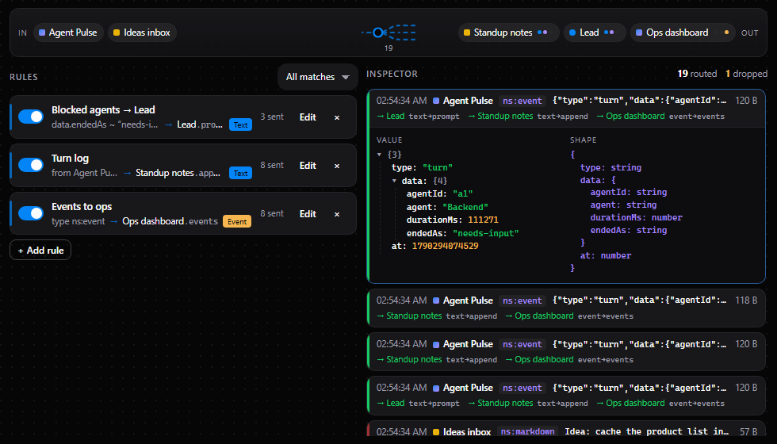
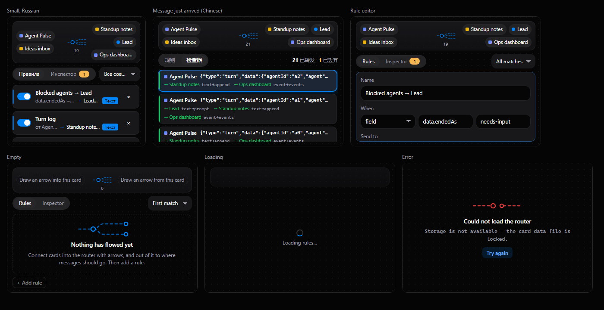

# Signal Router

A patch bay for your [NeuroSquad](https://neurosquad.ai) canvas. Draw arrows
into it from any card, draw arrows out of it to where messages should go, and
write rules: *"when a finished turn says `needs-input`, prompt the Lead"*,
*"everything from Agent Pulse → the standup note as a bullet"*, *"all events →
the ops dashboard"*. A live inspector shows every message that flows through —
who sent it, its type and size, the value as a tree, its inferred shape, and
exactly where each rule sent it (or why it did not).



- **Typed ports.** In: `in` (`ns:any`, takes anything) and `last` (a
  request-mode input: ask it and get the last message plus the counters as
  `ns:json`). Out: `text` (`ns:markdown`), `json` (`ns:json`), `event`
  (`ns:event`).
- **Peer discovery.** The patch bay lists the cards connected in and out. Each
  target shows which of the router's outputs it can take (the same
  compatibility rules the app uses — `portsCompatible` / `pickInputFor`), and the
  rule editor strikes out formats that would not fit.
- **Explicit delivery.** Every rule sends to one peer and one of its inputs
  (`card.ports.send(to, output, data, { input })`), not a broadcast.
- **Rules**: match anything, text that contains…, a JSON field by dot path
  (`data.endedAs` equals/contains…, or just "has the field"), the sending card,
  or the sender's port type. Shape as text with `{{field}}` templates, as JSON,
  or wrapped as an event. First match wins, or all matches fire.
- **Guards.** A per-rule limit per minute (prompts to agents are capped at 6 a
  minute, the app's own limit); a message is never echoed back to the card it
  came from; paused routing drops and counts. Drops show on the header badge
  until you look at the inspector.
- Overview tile ("142 routed · 3 rules"), English, Russian and Chinese.



## Permissions

**None are required.** Arrows are already the user's consent for data flow, and
routing between custom cards needs no permission at all. Two optional ones are
asked for only when you save a rule whose target needs them:

| Permission | Required | Why |
| --- | --- | --- |
| `cards.connected` | optional | A rule sends into a connected built-in note, checklist, board or sticky. |
| `agents.prompt` | optional | A rule sends messages to a connected AI agent as prompts. Capped per rule (≤ 6/min), queued by the app while the agent works, and every prompt shows on the arrow. |

No network, no files. Rules, counters and the last 10 messages (≤ 64 KB each)
are kept in the card's own storage.

## Performance

Idle, the card does nothing: no timers, no polling. Work happens only when a
message arrives. The flowing-wire animation pauses whenever the card is not on
screen.

## Develop

```sh
npm install
npm run dev        # the router on the SDK's mock host with simulated peers and traffic
npm test           # model + controller tests against createMockHost()
npm run build      # → dist/ (commit it: the app installs the repository as is)
npm run validate   # the app's own checks + the install dialog preview
npm run pack       # what would be installed, and the tree hash
```

Preview: `?state=filled|empty|loading|error|updated&lang=en|ru|zh&live=0&tab=inspector&edit=<rule id>&open=1`.
In the app: **Settings → Custom cards → Developer mode**, then
`npx neurosquad-card dev`.

### The SDK dependency

The card depends on [`@neurosquad/card-sdk`](https://www.npmjs.com/package/@neurosquad/card-sdk)
from npm (`^1.0.0`). `dist/` is committed on purpose: NeuroSquad installs the
repository as it is and never runs a build, so rebuild and commit `dist/`
together with every source change.

## Install

This is an official NeuroSquad card from
[`glmn-ai/neurosquad-cards`](https://github.com/glmn-ai/neurosquad-cards), listed in its
[verified catalog](../../verified.json). Install it from the verified catalog in
**Settings → Custom cards**, or paste the source
`glmn-ai/neurosquad-cards/official-cards/signal-router` into **Settings → Custom cards →
Install**. Check the permissions, then add
the card from the canvas: **+ → Custom card… → Signal Router**. Connect cards to
it with arrows.

## License

MIT
